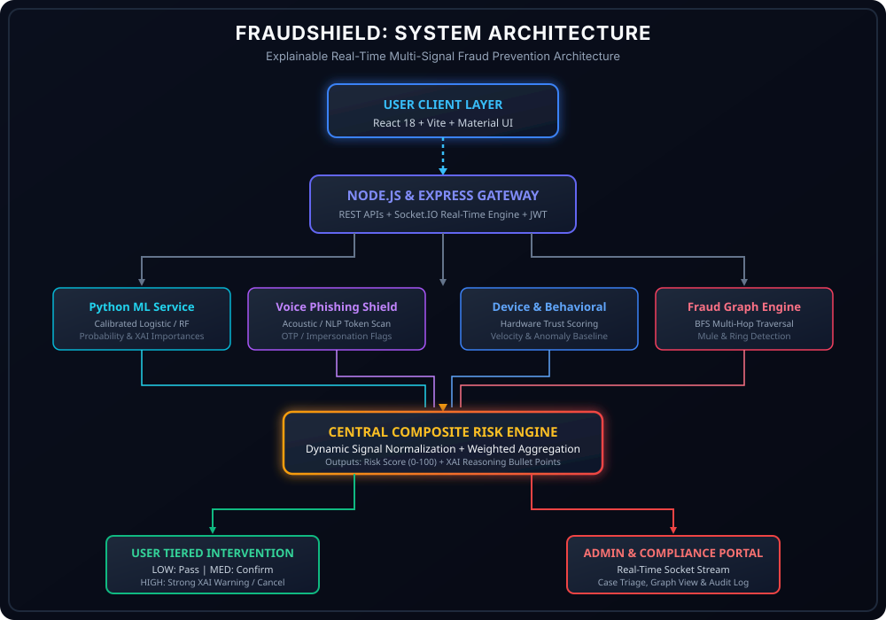
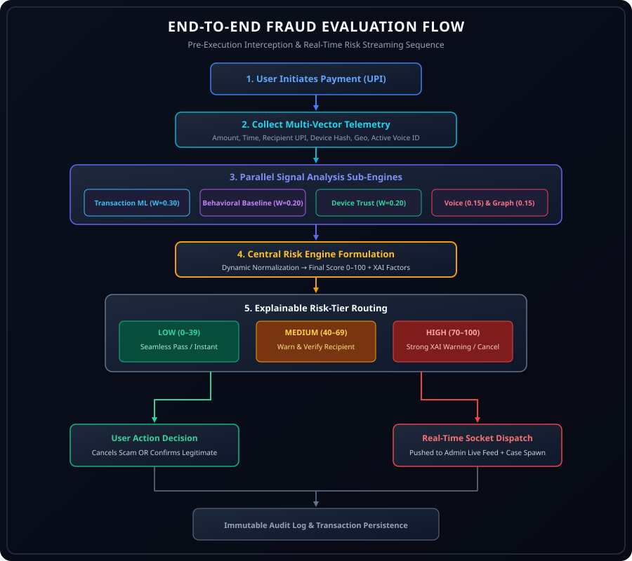
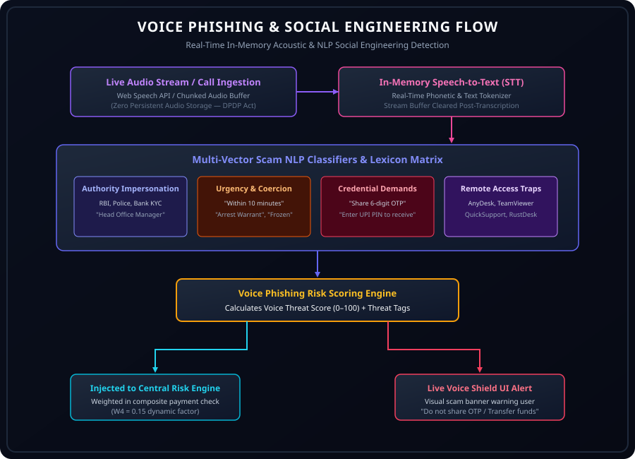
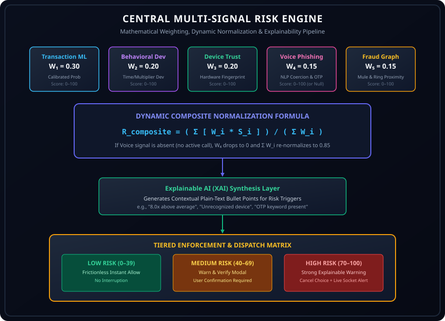
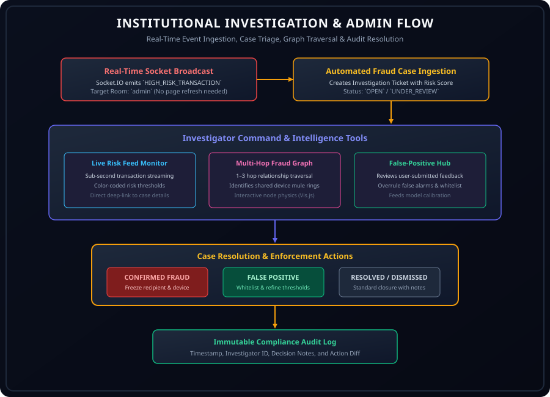

# Architecture & Flow Diagrams — FraudShield

This directory contains vector diagrams (`.svg`) detailing the system architecture, payment interception flow, voice phishing NLP pipeline, central risk mathematical engine, and administrative investigation lifecycle.

---

## 1. System Architecture (`system-architecture.svg`)
Illustrates the 4-tier system layout:
- **Client Layer**: React 18 + Vite + Material UI
- **API Gateway**: Node.js + Express + Socket.IO + JWT
- **Parallel Defense Services**: Python ML Service, Voice Phishing Shield, Device & Behavioral Intelligence, Fraud Graph Engine
- **Central Risk Engine**: Dynamic Composite Weighted Aggregation
- **Outputs**: Tiered User Intervention & Real-Time Admin Command Center

---

## 2. End-to-End Fraud Evaluation Flow (`fraud-flow.svg`)
Traces a UPI transaction from initiation through pre-auth signal ingestion, parallel scoring, explainable risk tiering, user confirmation/cancellation, socket dispatch, and audit logging.

---

## 3. Voice Phishing & Social Engineering Flow (`voice-flow.svg`)
Details real-time audio chunk ingestion, in-memory speech-to-text tokenization, multi-vector scam category scanning (Impersonation, Urgency, Credential Demands, Remote Access), and dual-output interception.

---

## 4. Central Multi-Signal Risk Engine (`risk-engine.svg`)
Breaks down the 5 input channels ($W_1=0.30, W_2=0.20, W_3=0.20, W_4=0.15, W_5=0.15$), dynamic normalization formula when voice signals are absent, and tiered risk enforcement rules.

---

## 5. Institutional Investigation & Admin Flow (`admin-flow.svg`)
Documents real-time WebSocket alert ingestion, automated fraud ticket creation, 3-hop relationship graph exploration, case resolution (`CONFIRMED_FRAUD`, `FALSE_POSITIVE`), and immutable audit logging.

