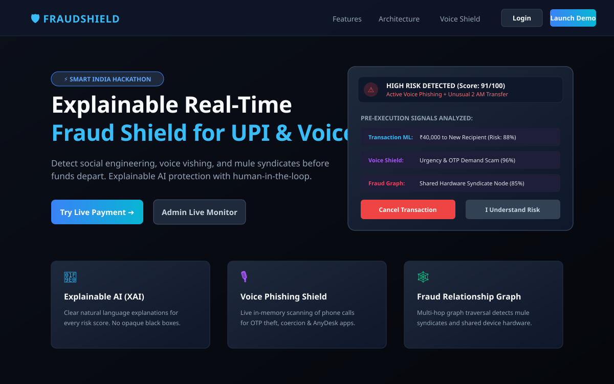
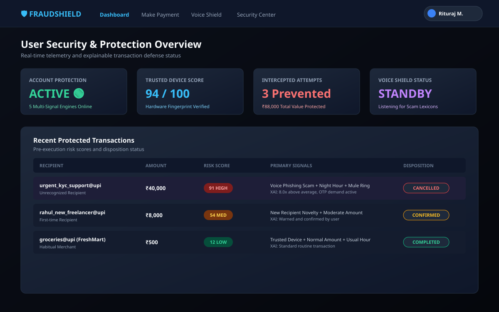
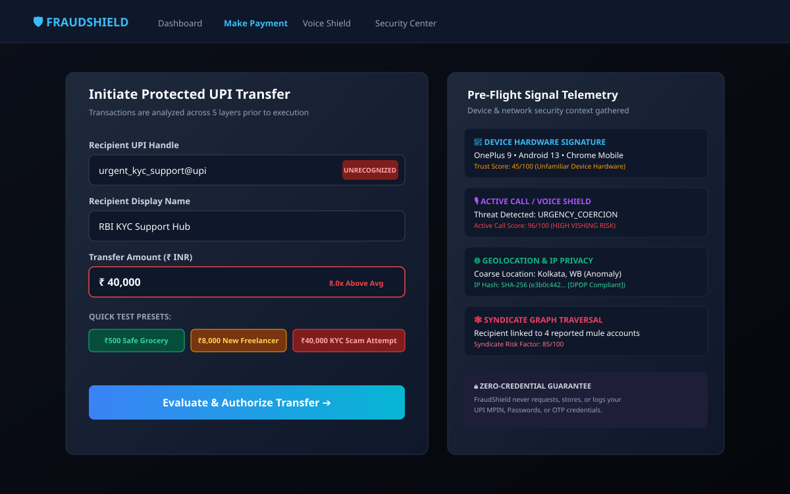
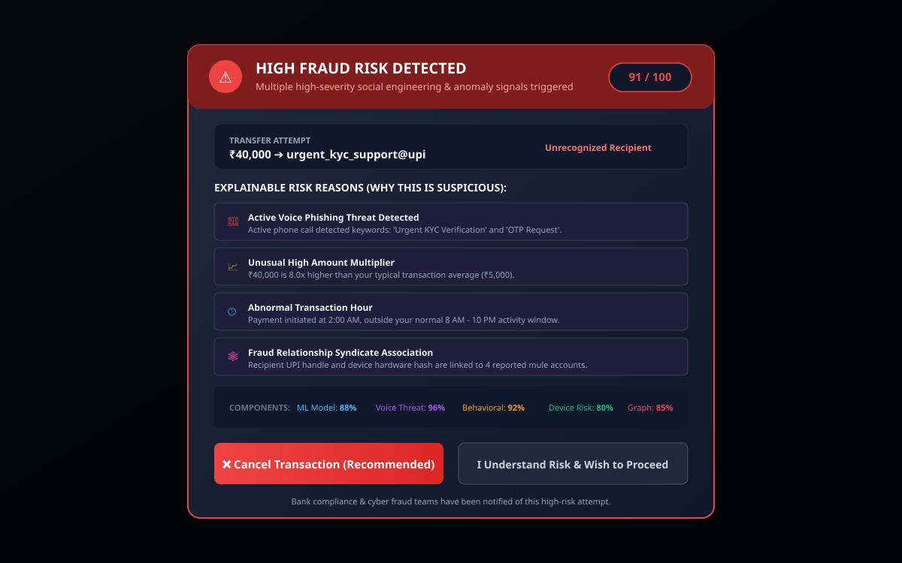
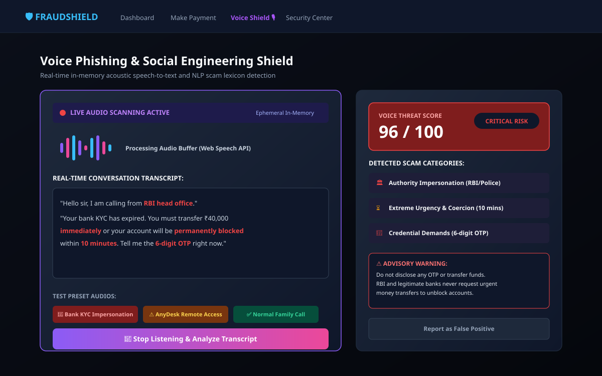
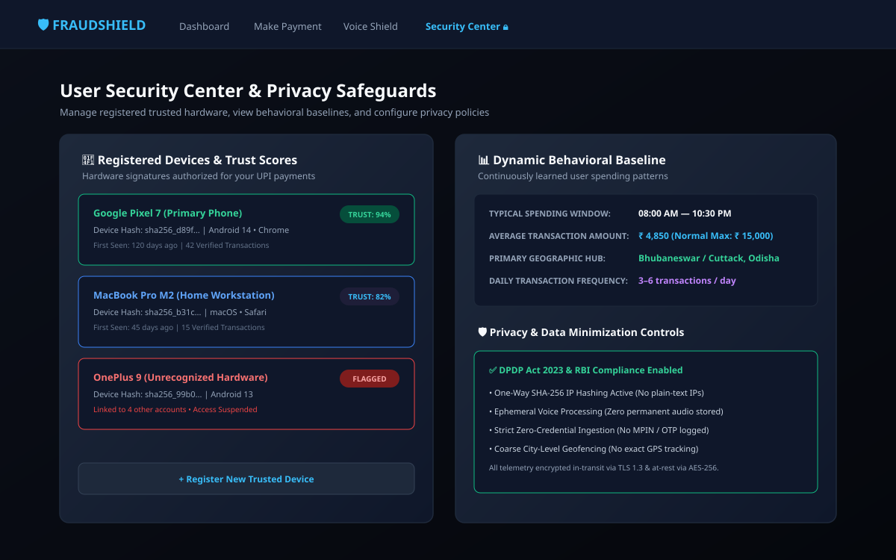
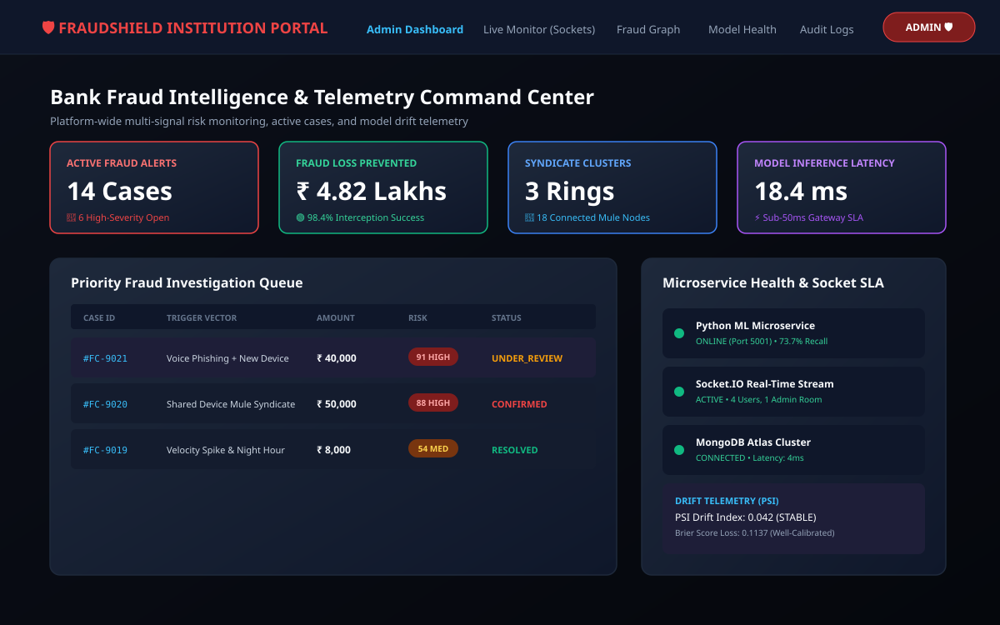
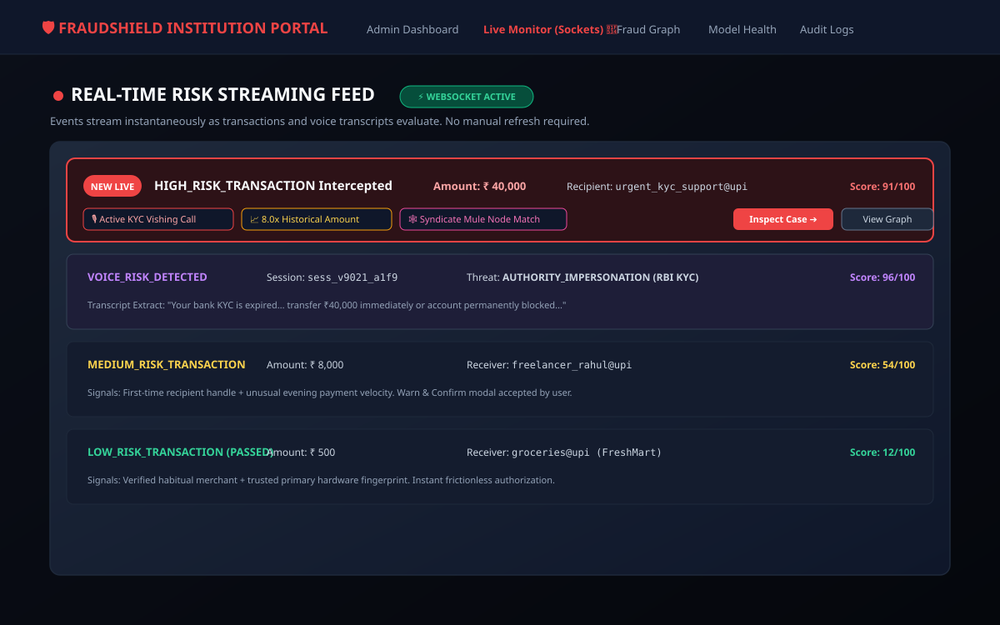
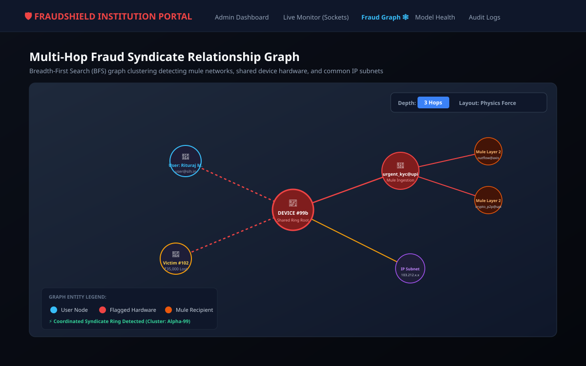

# UI Interface Screenshots & Visual Previews — FraudShield

This directory contains vector screenshots (`.svg`) representing all primary end-user and institutional investigation views of FraudShield.

---

## 1. Landing Page (`landing-page.svg`)
The public-facing portal highlighting core innovations: Explainable AI, Voice Phishing Shield, and Fraud Relationship Graph.

---

## 2. User Security Dashboard (`dashboard.svg`)
The end-user dashboard displaying account protection status, device trust scores, intercepted fraud savings, and recent transaction history.

---

## 3. Protected Payment Simulator (`payment.svg`)
The payment initiation screen with active telemetry context (hardware signature, coarse location, active call threat status, and syndicate graph checks).

---

## 4. Explainable AI Fraud Warning Screen (`fraud-warning.svg`)
The high-risk intervention modal displaying plain-language natural language reasons, component score breakdown, and user cancel/confirm buttons.

---

## 5. Voice Phishing Shield (`voice-shield.svg`)
The live acoustic/NLP scanner performing in-memory transcript parsing to intercept authority impersonation, urgency coercion, and OTP theft.

---

## 6. Security Center & Privacy Safeguards (`security-center.svg`)
Device registration management, dynamic behavioral baselines, and DPDP Act 2023 / RBI data minimization controls.

---

## 7. Admin Command Center (`admin-dashboard.svg`)
The institutional dashboard tracking open fraud cases, prevented monetary losses, syndicate clusters, and ML microservice latency.

---

## 8. Real-Time WebSocket Live Monitor (`live-monitor.svg`)
The sub-second live streaming feed pushing newly evaluated high-risk transactions directly to investigators without page reloads.

---

## 9. Multi-Hop Fraud Relationship Graph (`fraud-graph.svg`)
The interactive graph explorer traversing 1–3 hops to uncover shared hardware rings, IP subnets, and multi-account mule syndicates.

